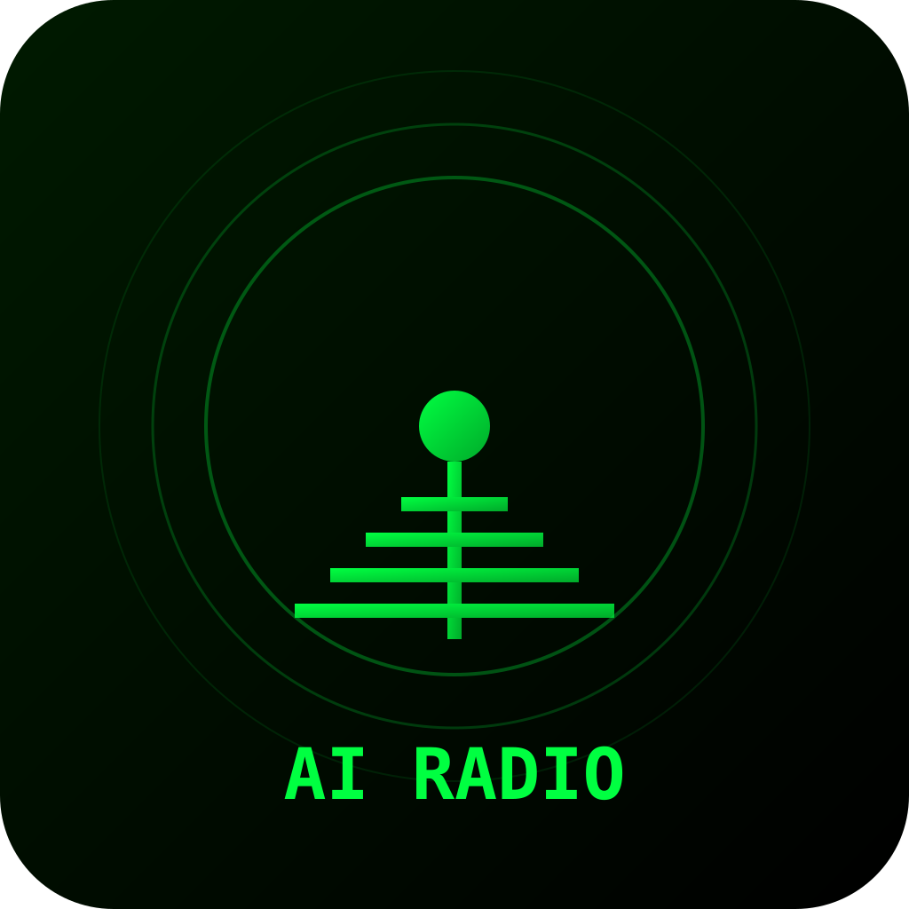

# AI Radio

A cross-platform desktop/mobile application that generates short, conversational radio-style audio content from topics or web links. Features both cloud LLM providers and fully offline on-device AI via llama.cpp.



## Features

- **Radio Script Generation** - Transform any topic or URL into a natural-sounding radio script
- **On-Device AI** - Run LLMs locally via llama.cpp (fully offline, no API key required)
- **Cloud LLM Providers** - Kilo Gateway, OpenCode AI, Google Gemini (optional)
- **Text-to-Speech** - Microsoft Edge TTS with high-quality neural voices
- **Multiple Styles** - Tech, casual, academic, entertaining, news, podcast modes
- **Quality Settings** - Short (30s), normal (90s), long (3min), chill (4min)
- **Episode History** - Persistent storage via IndexedDB
- **System Tray** - Minimize to tray on desktop
- **Cross-Platform** - Windows, Android (via Tauri v2)

## Quick Start

### Prerequisites

- [Bun](https://bun.sh) >= 1.3.0
- [Rust](https://rustup.rs) (for Tauri build)
- [Tauri Prerequisites](https://v2.tauri.app/start/prerequisites/)

### Development

```bash
# Install dependencies
bun install

# Start Vite dev server (frontend only)
bun run dev

# Start Tauri development mode (full app with hot reload)
bun run tauri dev
```

### Building

```bash
# Build frontend for production
bun run build

# Build Tauri app for release
bun run tauri build

# Pre-release check (format + lint + typecheck)
bun run check
```

### Platform-Specific Builds

```bash
# Windows
bun run tauri build --target x86_64-pc-windows-msvc

# Android (requires Android SDK)
bun run tauri build --target arm64-v8a-linux-android
```

## On-Device AI (Local LLM)

AI Radio includes built-in support for running LLMs locally via **llama.cpp**. This enables fully offline radio script generation without any API keys.

### How It Works

1. The app bundles `llama-server` as a Tauri sidecar
2. GGUF models are downloaded to the app's data directory
3. The local LLM runs on port 8080 while the app is active
4. Scripts are generated using the same prompt engineering as cloud providers

### Getting Started with Local AI

1. Open AI Radio and go to **Settings**
2. Select **"Local (llama.cpp)"** as the AI provider
3. Download a model using the built-in model manager, or pick an existing `.gguf` file
4. The server starts automatically when you generate a script

### Recommended Models

| Model                 | Size | RAM Required | Quality                |
| --------------------- | ---- | ------------ | ---------------------- |
| Qwen2.5-1.5B-Instruct | 1.5B | ~2 GB        | Good for short scripts |
| Qwen2.5-3B-Instruct   | 3B   | ~4 GB        | Better coherence       |
| Llama-3.2-3B-Instruct | 3B   | ~4 GB        | Great for English      |
| Gemma-2-2B-IT         | 2B   | ~3 GB        | Fast, multilingual     |

Models are stored in:

- **Windows**: `%APPDATA%\com.airoadio.desktop\models\`
- **Linux**: `~/.local/share/com.airoadio.desktop/models/`

### Model Sources

Download GGUF models from:

- [Hugging Face - GGUF](https://huggingface.co/models?sort=trending&search=gguf)
- [TheBloke's Models](https://huggingface.co/TheBloke)

## Cloud LLM Setup (Optional)

Cloud providers enhance script quality but require API keys. The app works fully offline without them.

### Supported Providers

| Provider          | Registration                             | Free Tier |
| ----------------- | ---------------------------------------- | --------- |
| **Kilo Gateway**  | [kilo.sh](https://kilo.sh)               | Yes       |
| **OpenCode AI**   | [opencode.ai](https://opencode.ai)       | Yes       |
| **Google Gemini** | [AI Studio](https://aistudio.google.com) | Yes       |

### Configuration

1. Get an API key from your chosen provider
2. Open AI Radio **Settings**
3. Select the provider and enter your API key
4. Or set it via environment variable (see below)

## Environment Variables

Copy `.env.example` to `.env` and configure:

```env
# LLM API Keys (optional - app works without these)
VITE_KILO_API_KEY=your_kilo_key
VITE_OPENCODE_API_KEY=your_opencode_key
VITE_GEMINI_API_KEY=your_gemini_key

# Default TTS voice (optional)
# German: de-DE-KillianNeural, de-DE-ConradNeural, de-DE-FreyaNeural, de-DE-KatjaNeural
# English: en-US-GuyNeural, en-US-JennyNeural
VITE_DEFAULT_VOICE=de-DE-KillianNeural

# Edge TTS token (optional, public token included by default)
VITE_EDGE_TTS_TOKEN=6A5AA1D4EAFF4E9FB37E23D68491D6F4
```

## Technologies

### Frontend

| Technology | Version | Purpose                               |
| ---------- | ------- | ------------------------------------- |
| Svelte     | ^5.0.0  | UI framework (runes syntax)           |
| TypeScript | ^5.5.0  | Type safety                           |
| Vite       | ^6.0.0  | Build tool and dev server             |
| Dexie      | ^4.0.10 | IndexedDB wrapper for episode storage |
| cheerio    | ^1.0.0  | HTML parsing                          |

### Desktop/Mobile

| Technology   | Version      | Purpose                      |
| ------------ | ------------ | ---------------------------- |
| Tauri        | ^2.0.0       | Cross-platform app framework |
| Rust         | 2021 edition | Native backend, system tray  |
| llama-server | bundled      | Local LLM inference          |

### LLM/TTS Providers

| Provider      | Endpoint                            | Model/Service            |
| ------------- | ----------------------------------- | ------------------------ |
| Kilo Gateway  | `api.kilo.ai`                       | kilo-auto/free           |
| OpenCode AI   | `opencode.ai`                       | mimo-v2.5-free           |
| Google Gemini | `generativelanguage.googleapis.com` | gemini-flash-lite-latest |
| Edge TTS      | `speech.platform.bing.com`          | Neural voices            |

## Project Structure

```
ai-radio/
├── src/
│   ├── App.svelte              # Main app component
│   ├── main.ts                 # Entry point
│   └── lib/
│       ├── db.ts               # Dexie IndexedDB wrapper
│       ├── edge-tts-client.ts  # Edge TTS WebSocket client
│       └── settings.ts         # Settings management + LLM integration
├── src-tauri/
│   ├── src/
│   │   ├── lib.rs              # Tauri commands, cloud LLM integration
│   │   ├── main.rs             # Desktop entry point
│   │   ├── local_llm.rs        # Local LLM server management
│   │   └── model_manager.rs    # GGUF model download/management
│   ├── binaries/               # Bundled llama-server sidecar
│   ├── Cargo.toml              # Rust dependencies
│   └── tauri.conf.json         # Tauri configuration
├── package.json
├── vite.config.ts
├── svelte.config.js
├── .env.example                # Environment variables template
└── README.md
```

## Development Commands

```bash
# Development
bun run dev              # Vite dev server
bun run tauri dev        # Full Tauri dev mode

# Quality
bun run lint             # Run ESLint
bun run lint:fix         # Auto-fix lint issues
bun run typecheck        # TypeScript checking
bun run format           # Prettier formatting
bun run check            # Format + lint:fix + typecheck

# Build
bun run build            # Build frontend
bun run tauri build      # Build Tauri app
bun run prebuild         # Prebuild check
```

## App States

- **OFFLINE** - No API key configured, uses fallback text generator
- **READY** - API configured, waiting for user input
- **GENERATING** - Script being generated via LLM
- **STREAMING** - Audio playback active

## License

MIT
